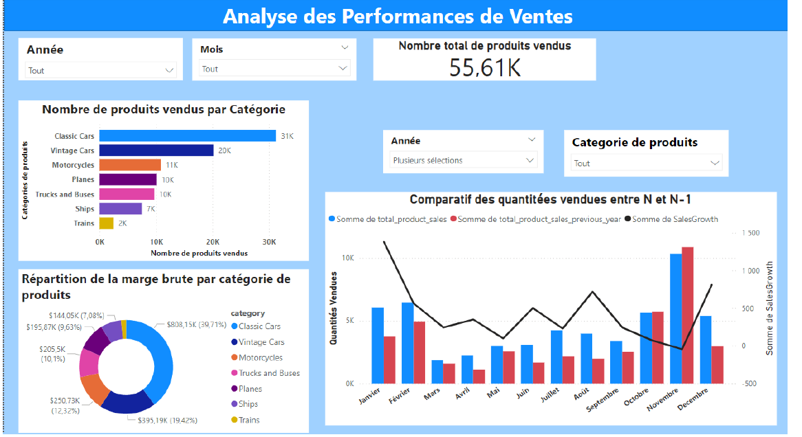
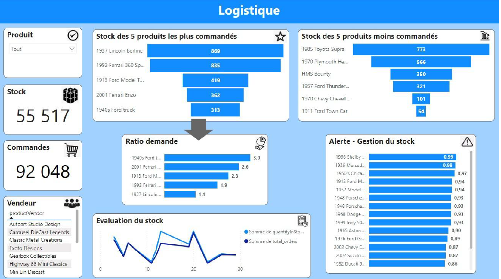
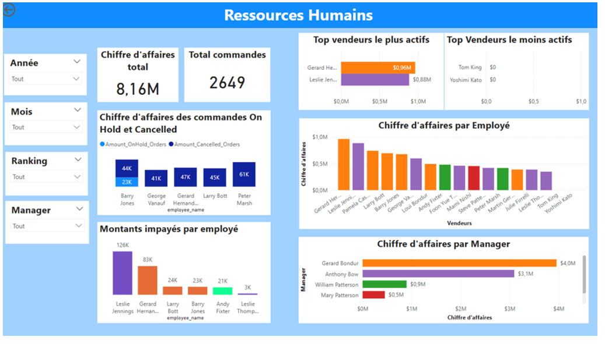
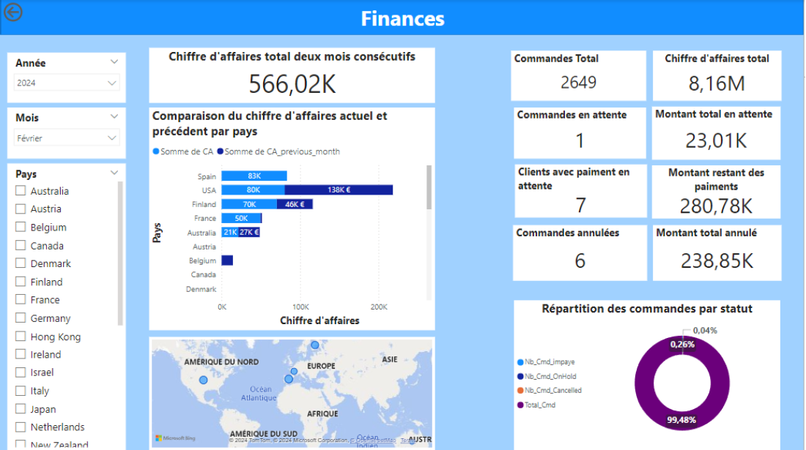

# WCS-Projet1-Analyse-Ventes
## Contexte 
Concevoir un tableau de bord interactif permettant d’analyser l'activité de l'entreprise autour de quatre axes stratégiques :
Ventes, Finances, Logistique et Ressources humaines.

Indicateurs à mettre en avant par proposer des KPI : 
- Ventes: Le nombre de produits vendus par catégorie et par mois, avec
comparaison et taux d'évolution par rapport au même mois de l'année
précédente.
- Finances:
     - Le chiffre d'affaires des commandes des deux derniers mois de la base
de données par pays.
     - Commandes qui n'ont pas encore été payées.
- Logistique: Le stock des 5 produits les plus commandés.
- Ressources humaines: Chaque mois, les 2 vendeurs avec le CA le plus
élevé.
## Structure de la base de données
La base de données est composée de plusieurs tables interconnectées, couvrant différents aspects de l'activité de l'entreprise :

- Produits et catégories de produits

- Commandes, détails de commande et paiements

- Clients, employés et bureaux

Le schéma relationnel ci-dessous permet de visualiser les liens entre ces différentes tables et de mieux comprendre la structure des données exploitées dans le tableau de bord.
 

 Voici un aperçu du tableau de bord développé pour analyser les ventes, les finances, la logistique et les ressources humaines :
 

  
  
  
      

